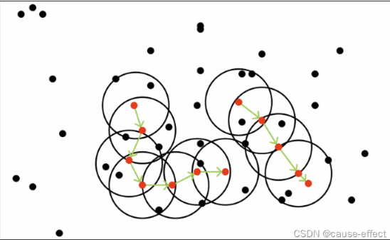

# DBSCAN

## 基本原理
DBSCAN详细描述及参数含义
DBSCAN是基于一组邻域来描述样本集的紧密程度的，参数(ϵ, MinPts)用来描述邻域的样本分布紧密程度。其中，ϵ描述了某一样本的邻域距离阈值，MinPts描述了某一样本的距离为ϵ的邻域中样本个数的阈值。
假设样本集是*D=(x1,x2,...,xm)*,则DBSCAN具体的密度描述如下：
1.  ϵ-邻域：对于xj∈D，其ϵ-邻域包含样本集D中与xj的距离不大于ϵ的子样本集，即Nϵ(xj)={xi∈D|distance(xi,xj)≤ϵ}, 这个子样本集的个数记为|Nϵ(xj)|　
2. 核心对象：对于任一样本xj∈D，如果其ϵ-邻域对应的Nϵ(xj)至少包含MinPts个样本，即如果|Nϵ(xj)|≥MinPts，则xj是核心对象。　
 -邻域中，且xj是核心对象，则称xi由xj密度直达。注意反之不一定成立，即此时不能说xj由xi密度直达, 除非且xi也是核心对象。
3. 密度直达：如果xi位于xj的ϵ-邻域中，且xj是核心对象，则称xi由xj密度直达。注意反之不一定成立，即此时不能说xj由xi密度直达, 除非且xi也是核心对象。
4. 密度可达：对于xi和xj,如果存在样本样本序列p1,p2,...,pT,满足p1=xi,pT=xj, 且pt+1由pt密度直达，则称xj由xi密度可达。也就是说，密度可达满足传递性。此时序列中的传递样本p1,p2,...,pT−1均为核心对象，因为只有核心对象才能使其他样本密度直达。注意密度可达也不满足对称性，这个可以由密度直达的不对称性得出。
5. 密度相连：对于xi和xj,如果存在核心对象样本xk，使xi和xj均由xk密度可达，则称xi和xj密度相连。注意密度相连关系是满足对称性的。

从下图可以很容易看出理解上述定义，图中MinPts=5，红色的点都是核心对象，因为其ϵ-邻域至少有5个样本。黑色的样本是非核心对象。所有核心对象密度直达的样本在以红色核心对象为中心的超球体内，如果不在超球体内，则不能密度直达。图中用绿色箭头连起来的核心对象组成了密度可达的样本序列。在这些密度可达的样本序列的ϵ-邻域内所有的样本相互都是密度相连的。

DBSCAN的聚类定义很简单：由密度可达关系导出的最大密度相连的样本集合，即为我们最终聚类的一个类别，或者说一个簇。
这个DBSCAN的簇里面可以有一个或者多个核心对象。如果只有一个核心对象，则簇里其他的非核心对象样本都在这个核心对象的ϵ-邻域里；如果有多个核心对象，则簇里的任意一个核心对象的ϵ-邻域中一定有一个其他的核心对象，否则这两个核心对象无法密度可达。这些核心对象的ϵ-邻域里所有的样本的集合组成的一个DBSCAN聚类簇。
那么怎么才能找到这样的簇样本集合呢？DBSCAN使用的方法很简单，它任意选择一个没有类别的核心对象作为种子，然后找到所有这个核心对象能够密度可达的样本集合，即为一个聚类簇。接着继续选择另一个没有类别的核心对象去寻找密度可达的样本集合，这样就得到另一个聚类簇。一直运行到所有核心对象都有类别为止。

# 几个基本问题
这里有三个问题没有考虑：
1.  （噪音点） 一些异常样本点或者说少量游离于簇外的样本点，这些点不在任何一个核心对象在周围，在DBSCAN中，我们一般将这些样本点标记为噪音点。
2.   （距离度量） （距离度量）距离的度量问题，即如何计算某样本和核心对象样本的距离。在DBSCAN中，一般采用最近邻思想，采用某一种距离度量来衡量样本距离，比如欧式距离。这和KNN分类算法的最近邻思想完全相同。对应少量的样本，寻找最近邻可以直接去计算所有样本的距离，如果样本量较大，则一般采用KD树或者球树来快速的搜索最近邻。
3.  （核心对象选择）第三种问题比较特殊，某些样本可能到两个核心对象的距离都小于ϵ，但是这两个核心对象由于不是密度直达，又不属于同一个聚类簇，那么如果界定这个样本的类别呢？一般来说，此时DB SCAN采用先来后到，先进行聚类的类别簇会标记这个样本为它的类别。也就是说DBSCAN的算法不是完全稳定的算法

# 关于存储方式
需要查询邻居信息，即查询一个点的所有邻居。
DBSCAN 需要为每个点保存其在半径 ε 内的所有邻居点。假设数据集有n个样本点，每个点的邻居数量可能不同：
- 最少情况：某个点没有任何邻居（孤立点），此时该点的邻居列表为空。
- 最多情况：某个点与其他所有点都是邻居（例如所有点都在 ε 半径内），此时该点的邻居列表包含n-1个点。

1. 这个步骤可以是只计算邻接矩阵D保存任意两点之间的距离，然后每次都从D中遍历得到邻居，这种方法在重复查询时浪费的时间多，但是消耗内存固定，每个点最多需要存储 n-1 个邻居（排除自身），整个数据集需要存储的邻居关系总数最多为 n × (n-1)。那么查询一个点的邻居信息的时间复杂度为O(n)，因为需要遍历所有的邻居信息，这个时间复杂度很高，整体时间复杂度为O(n2)。

    > 实现逻辑
    > 预计算一个 n×n 的矩阵 D，其中 D[i][j] 表示点 i 与点 j 的距离。
    > 查询邻居时：对给定点 i，遍历所有 j∈[0, n-1]，判断 D[i][j] ≤ ε，满足条件的 j 即为邻居。

2. 也可以是计算任意两点之间的距离时就保存邻居信息，查询的时候直接返回已有的邻居信息即可，但是保存所有邻居信息需要的内存不固定，最大n(n-1)，每个点最多需要存储 n-1 个邻居（排除自身），整个数据集需要存储的邻居关系总数最多为 n × (n-1)。那么查询一个点的邻居信息的时间复杂度为O(1)，因为查询一个点的邻居信息只需要返回邻居信息即可，不需要遍历所有的邻居信息。
    >实现逻辑
    >预处理时，对每个点 i，直接保存其在 ε 半径内的所有邻居索引（如列表 neighbors[i]）。需要时间复杂度为O(n2)
    >查询邻居时：直接返回 neighbors[i]，无需重新计算距离或遍历全量数据。

目前采用的是第二种方法，因为对于室内雷达来说，点云数量很少,需要多帧叠加点云数据，

|存储方式|内存消耗|查询效率|适用场景|
|:--:|:--:|:--:|:--:|
|邻接矩阵 D|固定为 n×n|	每次查询需遍历行，复杂度为O(n)|重复查询少，内存有限|
|预存邻居列表|最多 n(n-1)|直接读取列表，复杂度为O(1)|重复查询多，内存充足|   

# 一些补充
1. 在距离的计算公式中并不完全是平面距离，这里加入是速度维度并且加上权重

$$ d=\frac{\sqrt{\left(c \cdot w_{r}\right)^{2}+\left(v \cdot w_{v}\right)^{2}}}{w_{r}+w_{v}} $$

- c：平面距离（meas->data[i].distance）。
- v：速度（meas->data[i].velocity）。
- \(w_r\) 和 \(w_v\)：权重，用于调整距离计算中各维度的重要性，
所以这里要配置四个参数

2. 矩阵结构
offset 的含义：前 i 个点（索引 0 到 i-1）的点对总数为 \(\frac{i(i-1)}{2}\)，即前 i-1 行的点对数量之和。示例：
当 i=1（第 2 个点），offset=0，处理点对 (1, 0)，存储到 D[0]。
当 i=2（第 3 个点），offset=1，处理点对 (2, 0) 和 (2, 1)，存储到 D[1] 和 D[2]。

删除被遮挡的点：当点a比点b近且点b速度为0，且b位于a背后的遮挡范围就删除点b.但是这段代码也不能完全解决静态杂波问题。之后会将之前提到的通过相位差绝对值累积来区分的方式也加上，但是这些方法都只是减少这种情况发生，不能完全解决。
该问题需要在目标跟踪部分解决。

                         