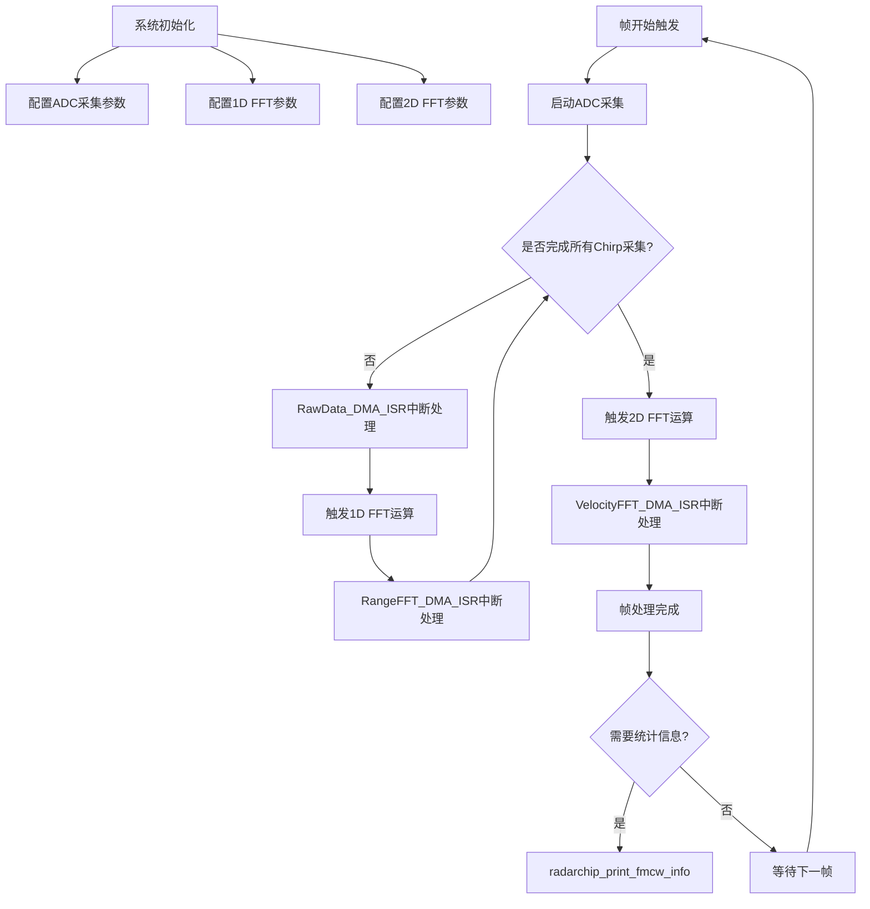
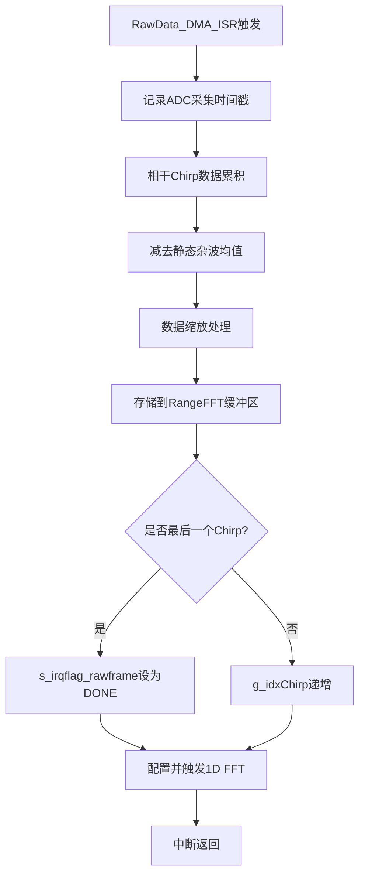
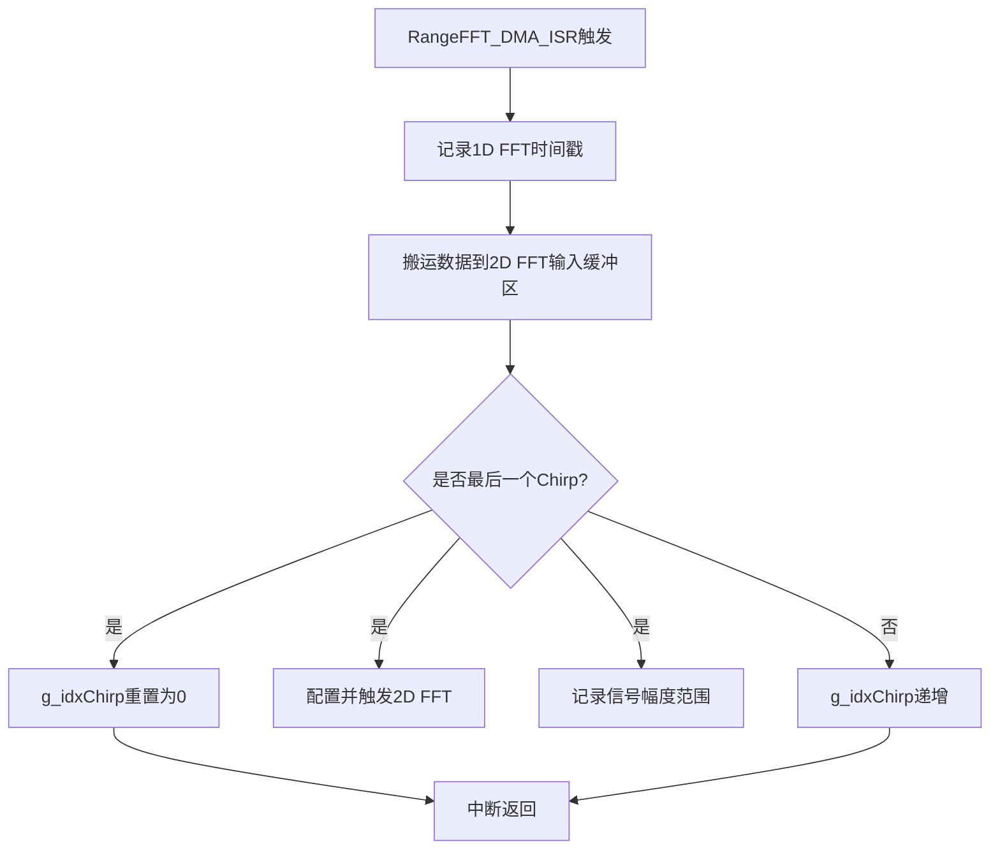
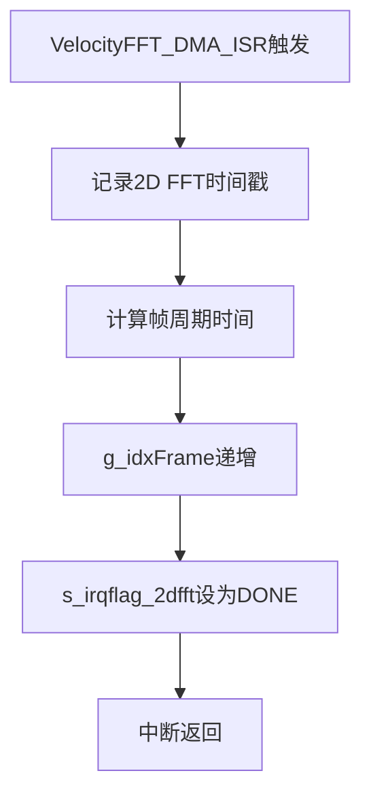
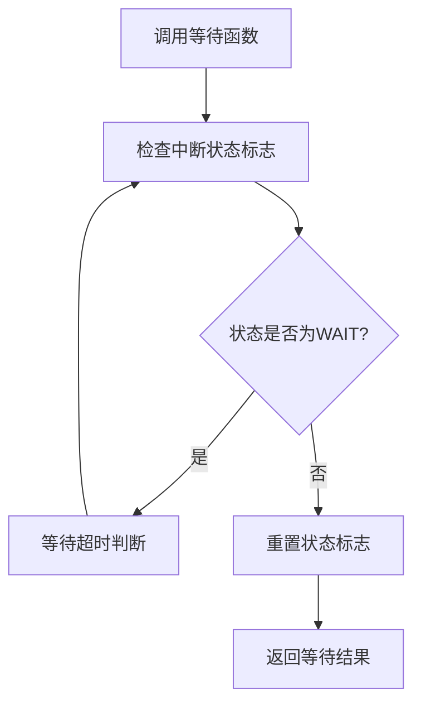

## 雷达信号处理系统流程图

```mermaid
graph TD
    A[系统初始化] --> B[配置ADC采集参数]
    A --> C[配置1D FFT参数]
    A --> D[配置2D FFT参数]
    
    E[帧开始触发] --> F[启动ADC采集]
    F --> G{是否完成所有Chirp采集?}
    G -- 否 --> H[RawData_DMA_ISR中断处理]
    H --> I[触发1D FFT运算]
    I --> J[RangeFFT_DMA_ISR中断处理]
    J --> G
    
    G -- 是 --> K[触发2D FFT运算]
    K --> L[VelocityFFT_DMA_ISR中断处理]
    L --> M[帧处理完成]
    
    M --> N{需要统计信息?}
    N -- 是 --> O[radarchip_print_fmcw_info]
    N -- 否 --> P[等待下一帧]
    P --> E
```
## RawData_DMA_ISR 中断处理流程图

```mermaid
graph TD
    A[RawData_DMA_ISR触发] --> B[记录ADC采集时间戳]
    B --> C[相干Chirp数据累积]
    C --> D[减去静态杂波均值]
    D --> E[数据缩放处理]
    E --> F[存储到RangeFFT缓冲区]
    
    F --> G{是否最后一个Chirp?}
    G -- 是 --> H[s_irqflag_rawframe设为DONE]
    G -- 否 --> I[g_idxChirp递增]
    
    H --> J[配置并触发1D FFT]
    I --> J
    J --> K[中断返回]
```
## RangeFFT_DMA_ISR 中断处理流程图

```mermaid
graph TD
    A[RangeFFT_DMA_ISR触发] --> B[记录1D FFT时间戳]
    B --> C[搬运数据到2D FFT输入缓冲区]
    C --> D{是否最后一个Chirp?}
    
    D -- 是 --> E[g_idxChirp重置为0]
    D -- 是 --> F[配置并触发2D FFT]
    D -- 是 --> G[记录信号幅度范围]
    
    D -- 否 --> H[g_idxChirp递增]
    E --> I[中断返回]
    H --> I
```
## VelocityFFT_DMA_ISR 中断处理流程图

```mermaid
graph TD
    A[VelocityFFT_DMA_ISR触发] --> B[记录2D FFT时间戳]
    B --> C[计算帧周期时间]
    C --> D[g_idxFrame递增]
    D --> E[s_irqflag_2dfft设为DONE]
    E --> F[中断返回]
```
## 帧处理等待机制流程图

```mermaid
graph TD
    A[调用等待函数] --> B[检查中断状态标志]
    B --> C{状态是否为WAIT?}
    C -- 是 --> D[等待超时判断]
    D --> B
    C -- 否 --> E[重置状态标志]
    E --> F[返回等待结果]
```
    