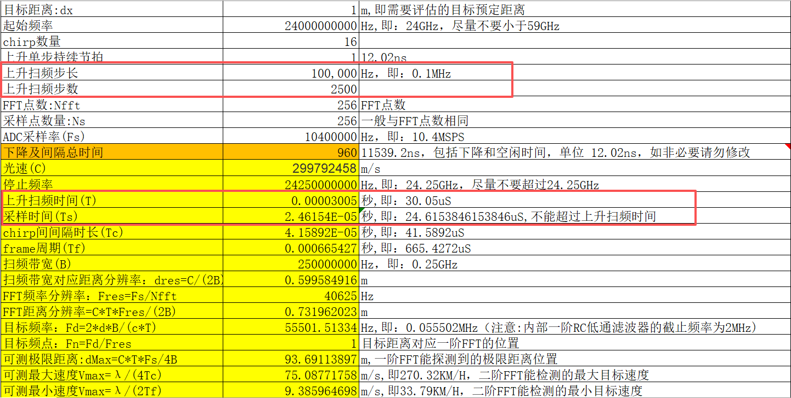
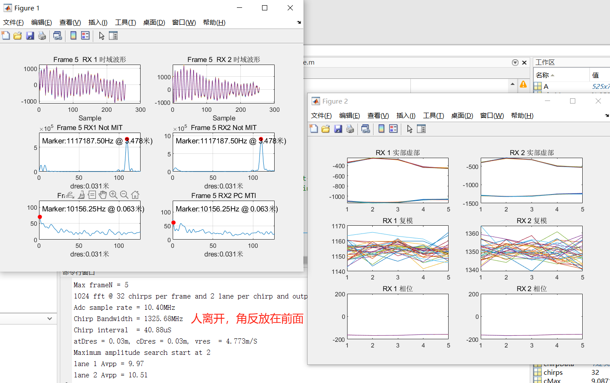
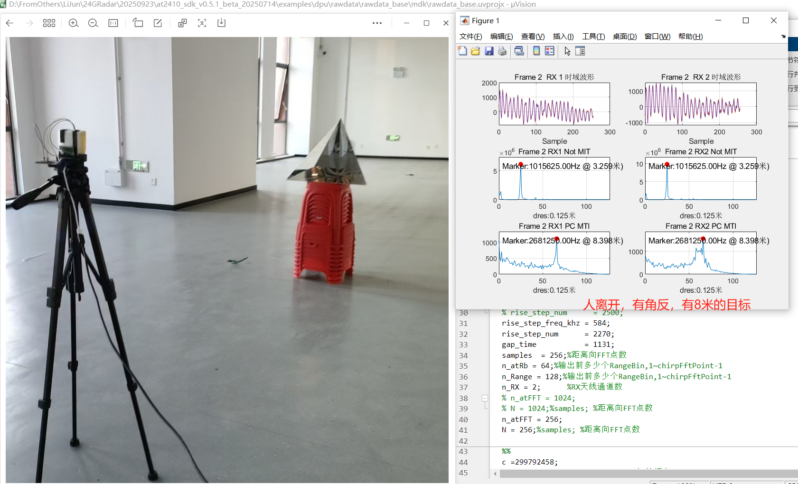
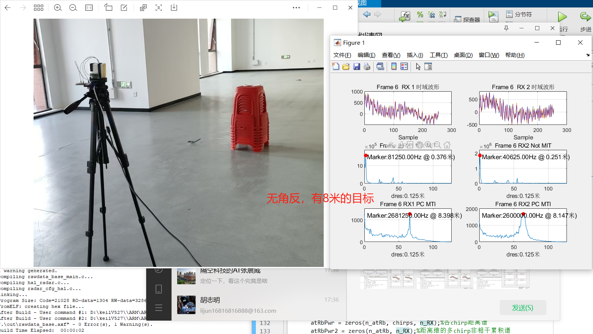

# 隔空波形配置例程
## Chirp信号参数计算

### 1.设定带宽
首先我们先来计算Chirp信号的相关参数：为了方便我们使用隔空给的表格

<div align="center"></div>
上图中，采样率为10.4MHz，采样点数为256点，那么一个Chirp的时间

$$T_{Chirp} = N_{pioint} / f_{sampling} = 256/10.4e6 = 24.615 \mu s$$

我们所设计的波形带宽为上升扫频步长*上升扫频步数
```c++
/** @brief FMCW 上升频率步长, 单位 KHz */
#define FMCW_RISE_STEP_FREQ_KHZ (100U)

/** @brief FMCW 上升频率步数，步长为 FMCW_RISE_STEP */
#define FMCW_RISE_STEP_NUM (2500U)
```
$$ B = 1e5 * 2500 = 250M $$
即每步0.1M 一共2500步   
那么上升沿扫频时间为
$$ T_{up} = 12.02 * T_{step} = 2500 * 12.02\mu s = 30.05\mu s $$

符合采样时间小于上升沿扫频时间的要求

### 2.设定发射功率和接收增益

```c++
/** @brief HPF1 的增益 */
#define HPF1_GAIN HPF1_GAIN_MAX

/** @brief HPF2 的增益 */
#define HPF2_GAIN HPF2_GAIN_21dB

/** @brief LPF 的增益 */
#define LPF_GAIN LPF_GAIN_9dB
```
根据波形是否发生阶段或者者噪声过大来调整增益，增益过大会导致信号饱和，增益过小会导致信号过小无法识别。

### 3.设定合理的采样延时时间
```c++
radar_filter_profile_t.sample_delay = 1
radar_filter_profile_t.filter_delay = 100
```
根据经验将radar_filter_profile_t.sample_delay = 1设置为恒定的1，可方便调试。接下来更改radar_filter_profile_t.filter_delay = 100，来调整采样延时时间保证整体采样周期中的稳定性即保证前面采样点幅值与后面保持齐平。

### 4.调整下降及间隔时间
```c++
radar_filter_profile_t.gap_time = 1131
``` 
根据咨询得知，
当带宽为1G以上。间隔时间不要低于960
当带宽为2G以上时，间隔时间最低1120
根据经验，间隔时间13为周期
当我们更改步长或者步数时，间隔时间也需要相应更改。
在雷达前方放置角锥，观察波形，调整间隔时间使得波形中能把角锥目标给滤除掉
<div align="center"></div>
在雷达前方静止，观察波形，调整间隔时间使得波形中能识别到人
<div align="center"></div>

### 5.注意事项
内部RC滤波的最高截止频率是2MHz, 设计扫频参数时，一般不推荐让有效信号的频率落到2MHz以外，可能会造成远距离有较强的一个目标
<div align="center"></div>
<div align="center"></div>


