## 总体参数
```c++
/* 常数（请勿修改） ----------------------------------------*/
#define FMCW_RISE_STEP (12.02e-9)        ///< FMCW上升时间步长,单位s
#define WAVE_LENGTH (0.0124266303834197) ///< 波长
#define ADC_SAMPLE_RATE (10.4e6)         ///< ADC采样率
#define NUM_TX_ANTENNA (1)               ///< 发射天线数量
#define NUM_RX_ANTENNA (2)               ///< 接收天线数量

/* 参数设置 ========================================*/

#define FMCW_RISE_STEP_FREQ_KHZ (103U) ///< FMCW上升频率步长,单位KHz
#define FMCW_RISE_STEP_NUM (2270U)     ///< FMCW上升频率步数, 步长FMCW_RISE_STEP
#define COHERENT_CHIRP_GAP (1120U)     ///< 相干组中chirp间隔，步长FMCW_RISE_STEP

#define RX_ANTENNA_SPACING (6.98e-3) ///< 接收天线间距

#define NUM_SAMPLE (256)         ///< 采样点
#define NUM_COHERENT_CHIRP (8)   ///< 相干累加的chirp数
#define NUM_CHIRP (64)           ///< 帧内chirp数量
#define NUM_RANGEBIN (16)        ///< 一阶FFT输出Range Bin数量，一般根据最大测距范围设定

#define COHE_ACC_SCALE_FACTOR 70 ///< 相干累加后数据的缩放倍数的分子，分母为16。
// 即当该参数设置为8时，相干累加后数据的缩放倍数为8/16 = 0.5

// #define MAX_SPEED_RANGE (2.325827952) ///< 最大测速，自动计算Chirp周期
#define MAX_SPEED_RANGE (2.314946047) ///< 最大测速，自动计算Chirp周期

#define TIME_FRAME_FULL (200e-3)      ///< 帧时长

 ///< 静态杂波更新周期，单位：s
#define STATIC_CLUTTER_UPDATE_PERIOD (2.0)      
///< 静态杂波更新权重，越大对慢速目标抑制越快                                    
#define STATIC_CLUTTER_UPDATE_WEIGHT ((uint32_t)(0.1 * (double)((uint64_t)1 << 31))) 

// 计算一些次生参数
#define BANDWIDTH ((double)(NUM_SAMPLE * FMCW_RISE_STEP_FREQ_KHZ * 1000) 
/ (ADC_SAMPLE_RATE * FMCW_RISE_STEP)) ///< 等效带宽
 ///< 等效Chirp时长
#define TIME_CHIRP ((double)NUM_SAMPLE / ADC_SAMPLE_RATE)          

#define NUM_CHANNEL (NUM_TX_ANTENNA * NUM_RX_ANTENNA)

#define TIME_CHRIP_TOTAL_EXPECTED ((double)WAVE_LENGTH 
/ (4.0 * MAX_SPEED_RANGE))                               ///< 期望的Chirp总时长
#define TIME_COHERENT_CHIRPS ((double)(FMCW_RISE_STEP_NUM + COHERENT_CHIRP_GAP)
 * FMCW_RISE_STEP * NUM_COHERENT_CHIRP) ///< 相干Chirp总时长

#define TIME_SUBFRAME_INTERVAL_US       ///< SUBFRAME间隔
((uint32_t)((TIME_CHRIP_TOTAL_EXPECTED - TIME_COHERENT_CHIRPS) * 1e6))     
///< Chirp总时长
#define TIME_CHRIP_TOTAL (TIME_COHERENT_CHIRPS + TIME_SUBFRAME_INTERVAL_US / 1e6)   
 ///< 等效帧间隔                                 
#define TIME_CHRIPGAP (TIME_CHRIP_TOTAL - TIME_CHIRP)                                                                 
```
## 距离 
### 公式推导
目标静止时，目标和雷达之间没有多普勒频偏，回波信号和发射信号之间只是存在一个时延，因此回波信号波形图是发射信号波形图沿时间轴的左右平移，如下左图。假设静止目标距雷达的距离为R，电磁波在空气中的传播速度为c，则接收信号和发射信号之间存在固定的信号延迟τ 
 ，因此理想情况下，
 发射信号假设为：
  <div align="center">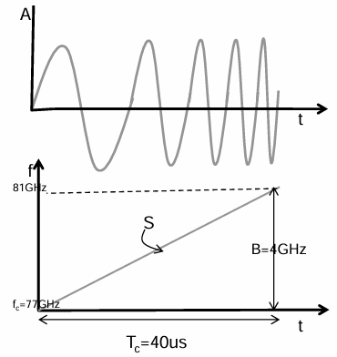</div>
  
 $$ \left.s_{t}(t)=A \cos \left(2 \pi\left(f_{0}t+\frac{St^{2}}{2}\right)+\phi_{0}\right)\right)$$

 回波信号模型可表示为：
  <div align="center">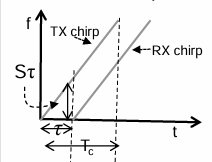</div>

$$ \left.s_{r}(t)=K A \cos \left(2 \pi\left(f_{0}(t-\tau)+\frac{S(t-\tau)^{2}}{2}\right)+\phi_{0}\right)\right) $$
中频信号的相位：
 <div align="center">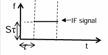</div>
 
$$ p_{t}(t)-p_{r}(t)=2 \pi f_{0} \tau+2 \pi S \tau t-\pi S \tau^{2} $$ 
对时间求导得到:
$$ f_m = S \tau  =\frac {B}T_c \frac {2R}c = \frac {2BR}{c T} $$
进而：
$$ R = \frac {c T_c f_m}{2B} $$

由此，我们可以得出结论，<span style="color:rgb(238, 17, 91);">雷达的探测距离与信号的斜率有关，斜率越小，探测距离越大。</span>
### 距离最大值
因为我们在混频后面要通过一个低通滤波器，所以低通滤波器的下限即决定着中频信号的上限，也制约着距离最大值，
 <div align="center">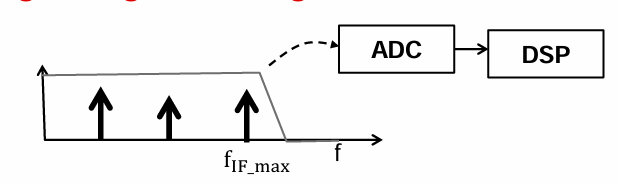</div>

$$ R_{max} = \frac {c T_c f_{max}}{2B} =\frac {c  f_{max}}{2S} $$
即验证了上面斜率越大，探测距离越小的理论
代码中对最大值做了限制为9米
```c++
    config.tracker_cfg.radius_range[0] = 0.3; ///< 距离范围最小值
    config.tracker_cfg.radius_range[1] = 9;   ///< 距离范围最大值
```

### 距离分辨率
如图,根据上面，离雷达距离不同，中频信号的频率也不同，那中频信号差多少能在中频信号里面分开呢，这就取决于频率分辨率，而根据傅里叶变换的公式，频率分辨率为
$$\frac{1}{T}（T 为观察窗口时长）$$

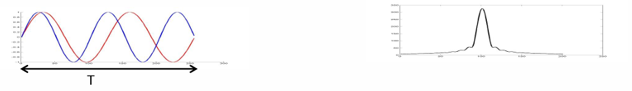
这里T是观察窗口时长，那么频率分辨率1/T,而这两个信号，红色调完成 2 个周期，蓝色调完成 2.5 个周期，所以频率分辨率为
$$\frac{2.5 - 2}{T} = \frac{0.5}{T} < \frac{1}{T}$$
所以在频谱上无法有效分辨。
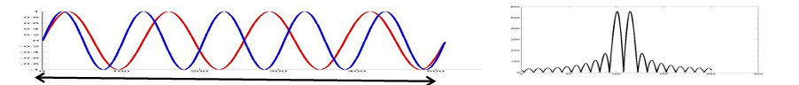
这个时候我们想到可以增加观察时间到2T，那么频率分辨率为
$$ \frac{5 - 4}{2T} = \frac{1}{2T} = \frac{1}{2T}(这个时候分辨率变为1/2T)$$
这个时候就可以在频谱上分辨出来了，增加观察时间在频率是意味着增加带宽，
 <div align="center">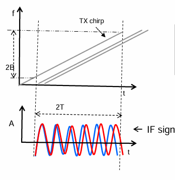</div>
 一般情况下，我们的观测时间不可能无限增大或者成两倍增大，那我们要讨论一下在固定的1/T分辨率下，距离的分辨率是多少，距离跟中频信号的频率关系为

$$ \Delta f = \frac{S2\Delta d}{c}  $$
这个值要大于1/T
$$ \Delta f > \frac{1}{T_c} \Rightarrow \frac{S2\Delta d}{c} > \frac{1}{T_c} \Rightarrow \Delta d > \frac{c}{2ST_c} \Rightarrow \frac{c}{2B} \ (\text{since } B = ST_c) $$ 
理解:<span style="color:rgb(238, 17, 91);">在观察窗口一定的时候，增加带宽(即增加斜率)可以有效的提高距离分辨率，只有在时间一定时候，增加尽可能多的带宽，目标之间的中频信号的间隔就越大，那么距离分辨率就越大。</span>
所以距离分辨率为 

$$ d_resc= \frac{c}{2B}$$
链接待代码中
带宽为

$$ (((double)((256) * (103U) * 10e6) / ((10.4e6) * (12.02e - 9))) = 210930500.45)$$

```c++
#define BANDWIDTH ((double)(NUM_SAMPLE * FMCW_RISE_STEP_FREQ_KHZ * 1000) / (ADC_SAMPLE_RATE * FMCW_RISE_STEP)) ///< 等效带宽
```
带入我们算得分辨率为
$$ d_resc= \frac{c}{2B} = \frac{3e8}{2 * 210930500.45} = 0.711135米$$

在这里回答一下PPT的问题
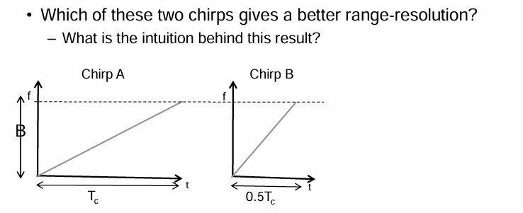
在这里我们套公式的话，他们的分辨率是一样的，同时也给我们了两种获得一样分辨率的两种波形文件配置的方法，要么增加带宽，要么增加观测时间，总之归根结底带宽决定了分辨率，
## 速度
### 公式推导
当冲激信号1完整的转了一圈，电磁波在空间中走了多远呢？一个波长λ 即，电磁波在空间中转一圈2π ，就传播了一个波长λ，发射信号的目标速度信息就体现在回波信号的相位变化上。
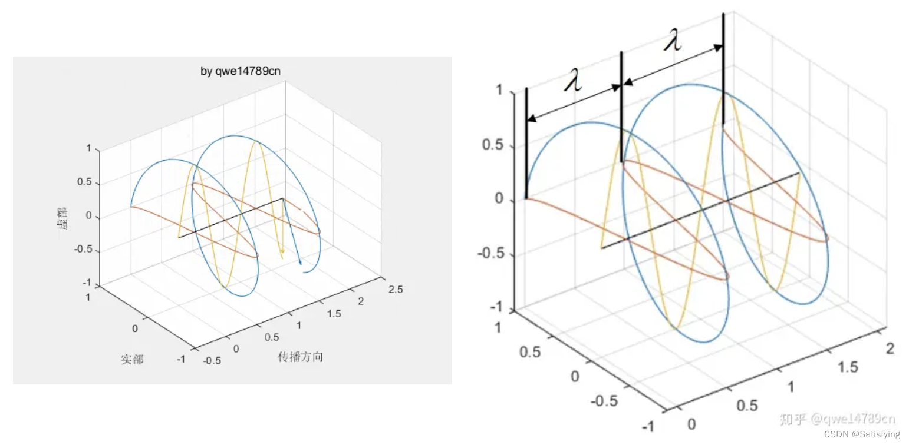
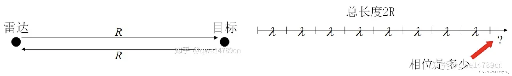
从上图可以看到，余下的长度是
$$ r = 2R - k \lambda $$
​对应对的相位为
$$ \phi = \frac{r}{\lambda} *2 \pi$$
因为相位变化也具有周期性，所以也可以表示为：
$$ \phi = \frac{2R}{\lambda} *2 \pi$$
体现在指数信息上，那么发射信号的相位就是
$$e^{j \theta} = e^{j \frac{4 * R}{\lambda}}$$
由于速度信息是包含在不同chrip间回波的相位差中，连续发送L个chrip信号，其相位差信息是随着chrip在不断变化的，因此对回波信号按照距离维-多普勒维排列存储之后，同一列的不同行对应的是相同频率、不同相位的回波信号（同频不同相）。具有相同频率、不同初始相位的正弦信号经过距离维FFT变换，会在相同频率处产生峰值，但峰值信号的相位不同，峰值的相位等于正弦信号的初始相位。因此对多普勒维做FFT，即可提取出回波信号的相位信息，即可解算出速度。中频信号的相位对目标微小位移的灵敏度是非常高的。
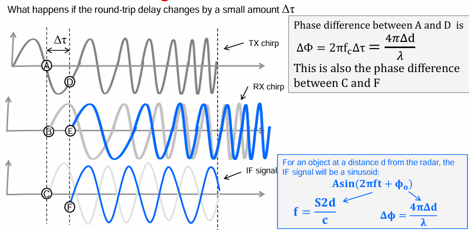
这是一个chrip对应的图解，连续发送L个chrip信号，由于物体的移动，回波的时延会有些许不同，但由于时延太短，无法直接获取，因此通过相位获取时延，所以对应的回波相位不同，相位差与相对位移之间的关系为
$$ \Delta \phi = \frac{4 \pi \Delta d }{\lambda} $$
同时 
$$ \Delta d =  v T_c $$ 
即在一个chrip时间内乘以速度，其中ω为相位差

$$ ω = \frac{4 \pi v T_c }{\lambda}\Rightarrow v = \frac{\lambda ω}{4 \pi T_c}$$

结论: <span style="color:rgb(238, 17, 91);">速度是由不同chrip回波信号的相位差决定的</span>

### 速度最大值
由常识可知道，相位不能大于180度，因为大于180的话你就不知道是正转的180+,还是负转的180-了，那么速度的最大值的约束就是|ω|小于Π，即
$$-\pi < \frac{ 4 \pi v T_c }{\lambda} < \pi \Rightarrow -\frac{\lambda}{4 \pi T_c} < v < \frac{\lambda}{4 \pi T_c}$$

带入到代码中
```c++
#define WAVE_LENGTH (0.0124266303834197) ///< 波长

#define NUM_SAMPLE (256)         ///< 采样点
#define ADC_SAMPLE_RATE (10.4e6)         ///< ADC采样率
#define TIME_CHIRP ((double)NUM_SAMPLE / ADC_SAMPLE_RATE)   ///< 等效Chirp时长
```
代码中做了如下限制，是根据速度最大值来反向逆推出chirp周期
```c++
#define MAX_SPEED_RANGE (2.314946047) ///< 最大测速，自动计算Chirp周期
```
### 速度分辨率
既然速度是由于不同chrip的相位差决定的，那分辨率自然由相位的分辨率决定,当你发送N个chrip，那么速度的分辨率也就是

$$ \Delta w = \frac{4 \pi \Delta v T_c }{\lambda} > \frac{2 \pi}N(N为chrip个数， \Delta w为相位差) 
\Rightarrow \Delta v > \frac{\lambda}{2  N T_c}$$

结论：<span style="color:rgb(238, 17, 91);">想要增大速度分辨率，需要增大chrip个数</span>

带入到代码中
```c++
#define WAVE_LENGTH (0.0124266303834197) ///< 波长
#define NUM_COHERENT_CHIRP (8)   ///< 相干累加的chirp数
#define NUM_CHIRP (64)           ///< 帧内chirp数量
#define TIME_CHIRP ((double)NUM_SAMPLE / ADC_SAMPLE_RATE)   ///< 等效Chirp时长24.615us
```
$$\Delta v =  \frac{\lambda}{2 N T_c} = 3.15cm/s$$
## 角度
### 公式推导
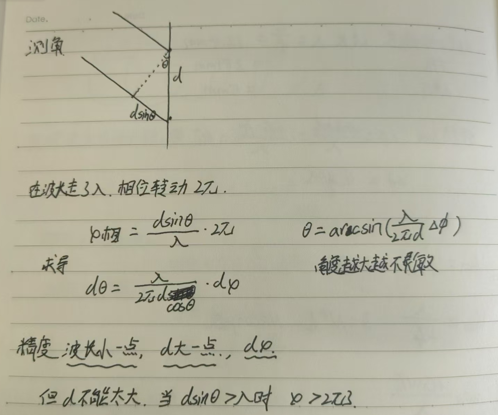
理解:还是根据相位的不同来分辨的，不过这不是比较不同chrip之间的相位差距，而是同一个chrip在不同天线会走不同的距离，比如图片中，两个天线走的路程差了一个

$$ dsinθ $$
这个时候通过比较这两个天线的回波，就可以知道这个角度了
由于这是两个天线之间的光程差，故

$$ \Delta\omega=\frac{2 \pi d \sin (\theta)}{\lambda}
 \Rightarrow \theta=\sin ^{-1}\left(\frac{\lambda \omega}{2 \pi d}\right)\Delta\omega为相位差$$

### 角度最大值
由于角度是由于相位决定的，所以可以根据理论上的w限制来推导出最大角度的限制,最大180
$$ \theta_{max}=\sin ^{-1}\left(\frac{\lambda }{2  d}\right)$$

对应在代码中
```c++
#define WAVE_LENGTH (0.0124266303834197) ///< 波长
#define NUM_RX_ANTENNA (2)               ///< 接收天线数量
#define RX_ANTENNA_SPACING (6.98e-3) ///< 接收天线间距
```
$$ \theta_{max}=  \pm \sin ^{-1}\left(\frac{0.0124266303834197}{2 * 6.98e-3}\right) = \pm 62.7度$$

### 角度分辨率
由于还是靠相位去分辨，根据两个目标之间的角度差要能区分出来，
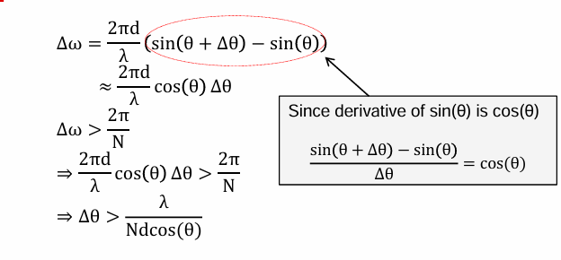

$$ \theta_{res}=\frac{\lambda }{Ndcos(\theta)}$$
带入到代码中
```c++
#define WAVE_LENGTH (0.0124266303834197) ///< 波长
#define NUM_RX_ANTENNA (2)               ///< 接收天线数量
#define RX_ANTENNA_SPACING (6.98e-3) ///< 接收天线间距
```
$$ \theta_{res}=\frac{0.0124266303834197}{2* 6.98e-3*cos(\theta)}
 = \frac{0.895}{cos(\theta)},这里单位是弧度,换算成角度需要*57.3度$$


