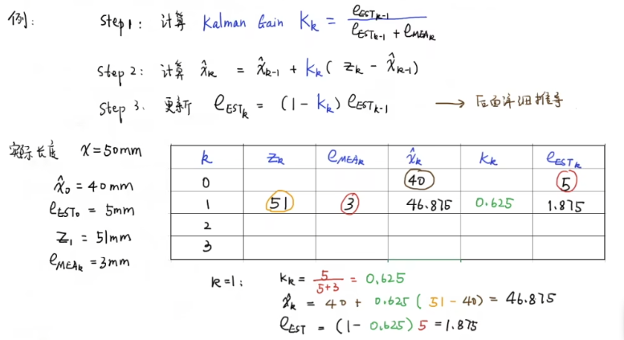
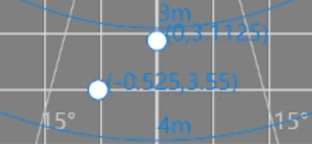

# Kalmam filter 递归算法

Optimal recursion data Processing Algorithm  其实是一种最优化的递归的数字处理算法

# 不确定性
为什么有卡尔曼滤波器，因为有不确定性
1. 传感器的不确定性
2. 不存在完美的数学模型
3. 系统扰动的不确定性

# 卡尔曼滤波器的递归算法
假设我们要测量一个硬币的长度，第k帧的观测值为$$Z_k$$

估计的真实数据最好的办法就是取前几次的平均值$$X_k$$
$$ X_k = \frac{1}{k} \sum_{i=1}^{k} Z_i 
= \frac{1}{k} \sum_{i=1}^{k-1} Z_i + \frac{1}{k} Z_kX_k  
 = X_{k-1} + \frac{1}{k} (Z_k - X_{k-1})$$
从上面公式我们可以看出，第K次的预测值$$X_k$$是第K-1次的预测值$$X_{k-1}$$加上一次的更新量$$\frac{1}{k} (Z_k - X_{k-1})$$
如果是测量一个固定的值，那么随着测量次数的增加，测量值将对最后的估计值的影响越来越小，（即测量值将不再那么重要）预测值的变化就会越来越接近测量值，因此这个预测值就是最优的预测值，也就是最优递归算法的结果

我们可以将上面的公式抽象一下

$$当前的估计值 = 上一次的估计值 + 系数（当前测量值-上一次的估计值）$$

那么这个系数是如何确定的呢

# 估计误差以及测量误差

### 估计误差（状态估计误差协方差矩阵 \(P_k\)）
定义：描述当前状态估计值与真实状态之间的偏差程度，是一个方阵（维度与状态向量一致）。

数学上，$$P_k = E\left[(x_k - \hat{x}_k)(x_k - \hat{x}_k)^T\right]，$$
其中 \(x_k\) 是真实状态，\(\hat{x}_k\) 是估计状态，\(E[\cdot]\) 表示期望。含义：\(P_k\) 的对角线元素表示各状态分量的估计误差方差（值越小，估计越精确）；非对角线元素表示状态分量之间的误差相关性。

### 测量误差（测量误差协方差矩阵 \(R_k\)）
定义：描述当前测量值与真实状态之间的偏差程度，是一个方阵（维度与状态向量一致）。

数学上，$$R_k = E\left[(z_k - H_k x_k)(z_k - H_k x_k)^T\right]，$$其中 \(z_k\) 是测量值，\(H_k\) 是测量矩阵

含义：\(R_k\) 的对角线元素表示各测量分量的测量误差方差（值越小，测量值越精确）；非对角线元素表示测量分量之间的误差相关性。
### 与卡尔曼增益（\(K_k\)）的关系
卡尔曼增益是滤波中权衡估计误差与测量误差的关键参数，其计算公式为：
$$K_k = P_k^- H_k^T (H_k P_k^- H_k^T + R_k)^{-1}$$
其中 \(P_k^-\) 是先验估计误差协方差（预测阶段的估计误差）。

测量误差（噪声） \(R_k\) 的影响：
\(R_k\) 越小（测量越精确），分母 \(H_k P_k^- H_k^T + R_k\) 越小，卡尔曼增益 \(K_k\) 越大。这意味着滤波结果会更多依赖测量值（因为测量更可靠）。
估计误差 \(P_k^-\) 的影响：
\(P_k^-\) 越大（先验估计越不可靠），分子 \(P_k^- H_k^T\) 越大，卡尔曼增益 \(K_k\) 越大。这意味着滤波结果会更多依赖测量值（因为先验估计误差大）。

### 更新后估计误差 \(P_k\) 与 \(K_k\) 的关系
卡尔曼增益直接决定了更新后估计误差的大小，公式为：\(P_k = (I - K_k H_k) P_k^-\)其中 I 是单位矩阵。当 \(K_k\) 增大时，\((I - K_k H_k)\) 减小，使得更新后的 \(P_k\) 更小（估计精度提升），但过度依赖测量值可能引入噪声。
## 卡尔曼数据融合，协方差矩阵，状态空间方程，观测器
数据融合见文件夹下的数据融合.png
### 协方差矩阵
协方差矩阵：方差，协方差在一个矩阵中表现出来，矩阵的对角线元素是方差，非对角线元素是协方差，矩阵的行列数是状态向量的维度。
方差越大说明跨度大，协方差说明两者关系。

协方差矩阵的计算公式为:
设存在 n 个随机变量 \(X_1, X_2, \dots, X_n\)，则它们的协方差矩阵 \(\Sigma\) 是一个 \(n \times n\) 的对称矩阵，其中第 i 行第 j 列的元素 \(\Sigma_{ij}\) 表示随机变量 \(X_i\) 和 \(X_j\) 的协方差，
计算公式为：
$$\Sigma_{ij} = \text{Cov}(X_i, X_j) = E\left[(X_i - E[X_i])(X_j - E[X_j])\right]$$
其中：\(E[X_i]\) 表示随机变量 \(X_i\) 的期望（均值）；\(\text{Cov}(X_i, X_j)\) 表示 \(X_i\) 和 \(X_j\) 的协方差。

### 卡尔曼增益
假设有有一个系统：
在状态转移方程和测量方程中
$$ \hat{x}_k^- = F_k \hat{x}_{k-1} + B_k u_k + w_{k-1}$$
$$z_k = H_k \hat{x}_k^- + v_k$$
\(w_{k-1}\) 是过程噪声（如目标运动时的突发加速、模型未考虑的外力等），Q 矩阵则是 \(w_{k-1}\) 的协方差矩阵（\(Q = E[ww^T]\)）
在代码中对应的是
```c++
 config.tracker_cfg.velocity_noise_coef =
        5.0;                     ///< 卡尔曼状态转移方程噪声系数，越大滤波后效果越接近测量值
```
\(v_k\) 是测量噪声（如传感器精度误差、环境干扰等），R 矩阵则是 \(v_k\) 的协方差矩阵（\(R = E[vv^T]\)）。
在代码中对应的是
```c++
    config.tracker_cfg.sigma_phi = 0.1; ///< 卡尔曼方位角标准差
    config.tracker_cfg.sigma_r = 0.2;   ///< 卡尔曼距离标准差
    config.tracker_cfg.sigma_r_dot = 0.1; ///< 卡尔曼距离变化率标准差
```
#### 矩阵结构：
Q 是与状态向量维度相同的方阵，对角线元素表示各状态量（如位置、速度）自身的过程噪声方差，非对角线元素表示状态量之间的过程噪声协方差（通常假设状态独立，非对角线为 0）。
R 是与测量向量维度相同的方阵，对角线元素表示各测量量（如雷达的距离、方位角、速度）自身的测量噪声方差，非对角线元素表示测量量之间的噪声协方差（通常假设测量独立，非对角线为 0）。

卡尔曼增益的计算公式为：$$K_k = P_k^- H_k^T (H_k P_k^- H_k^T + R)^{-1}$$
其中 \(P_k^-\) 是先验估计误差协方差矩阵，其更新公式为：

$$P_k^- = F_k P_{k-1} F_k^T + Q_k$$
可见，
- Q 矩阵通过影响 \(P_k^-\) 间接决定卡尔曼增益 \(K_k\)，
- R 矩阵通过分母项直接影响卡尔曼增益，

Q 增大 → \(P_k^-\) 增大（先验估计的不确定性增加） → 卡尔曼增益 \(K_k\) 增大 → 滤波结果更依赖测量值（因为模型预测的可信度下降）。
Q 减小 → \(P_k^-\) 减小（先验估计更可信） → 卡尔曼增益 \(K_k\) 减小 → 滤波结果更依赖预测值（模型的权重更高）
R 增大 → 分母 \((H_k P_k^- H_k^T + R)\) 增大 → 卡尔曼增益 \(K_k\) 减小 → 滤波结果更依赖预测值（因为测量的可信度下降）。
R 减小 → 分母减小 → 卡尔曼增益 \(K_k\) 增大 → 滤波结果更依赖测量值（传感器数据的权重更高）

简单来讲就是
Q 矩阵相当于对 “模型可靠性” 的打分：Q 越大，认为模型越不可靠，因此让测量值（传感器数据）在滤波中占更大权重（通过增大 K 实现）。
R 矩阵相当于对 “传感器可靠性” 的打分：R 越大，认为传感器测量越不可靠，因此让模型预测在滤波中占更大权重（通过减小 K 实现）。
卡尔曼增益则是这种权衡的量化结果：Q 与测量噪声协方差矩阵 R 共同决定了 “相信模型多一点” 还是 “相信传感器多一点”

### 代码中的实现与实际问题对应
理论中的Q在代码中对应的是
```c++
    config.tracker_cfg.velocity_noise_coef =
        5.0;                     ///< 卡尔曼状态转移方程噪声系数，越大滤波后效果越接近测量值
```
在测试中发现在室内场景下。人员目标会频繁变换角度和速度方向等。
如果该值过小，表明更信任预设的运动模型，滤波结果会更平滑（抑制噪声能力强），但可能因过度依赖模型而滞后于目标的实际运动（尤其当目标突然变向或加速时）会造成如下视频1情况：
<div align="center"><video controls src="8e984fc1e5ce8bbdb87ba7ebad7243f3.mp4" title="Title"></video></div>
该值越大，表明认为运动模型的不确定性越高（过程噪声越大），滤波结果会更 “信任” 雷达的测量值，由于超分辨率在多人场景下会造成两个目标互相吸引靠近，滤波后的轨迹更贴近原始测量数据，带来的影响会牺牲掉多人情况下的分辨能力。同时可能引入更多的噪声。
做不到如下图的分辨率
<div align="center"></div>

```c++  
    config.tracker_cfg.sigma_phi = 0.1; ///< 卡尔曼方位角标准差
    config.tracker_cfg.sigma_r = 0.2;   ///< 卡尔曼距离标准差
    config.tracker_cfg.sigma_r_dot = 0.1; ///< 卡尔曼距离变化率标准差
```
以上三个参数分别表示
- sigma_phi:表示雷达测量目标方位角（角度）的噪声标准差，用于构建 R 矩阵中对应方位角的对角元素（\(\sigma_\phi^2\)）
- sigma_r:表示雷达测量目标距离（径向距离） 的噪声标准差，用于构建 R 矩阵中对应距离的对角元素（\(\sigma_r^2\)）。
- sigma_r_dot:表示雷达测量目标距离变化率（速度）的噪声标准差，用于构建 R 矩阵中对应距离变化率的对角元素（\(\sigma_{r_dot}^2\)）。

1. 角度测量噪声的影响
在测试中发现（左右横摆）
该值越大，表明认为方位角的测量噪声越大，卡尔曼滤波会 “轻视” 角度测量值，更多依赖预测模型，角度的滤波结果更平滑，但可能引入角度偏差，导致静止目标“左右”摇摆。
该值越小，表明认为方位角测量越精确，滤波会更信任角度测量值，结果更贴近测量数据，但可能保留角度噪声（如雷达扫描时的角度抖动）,这个影响目前没有体现出来，如果后续装在空调上空调扇叶或者自身抖动可能会导致出现角度噪声。
2. 距离测量噪声的影响(多径)
该值越大，认为距离测量噪声越大，滤波会更多依赖模型预测，距离结果更平滑，但可能在目标快速靠近 远离时出现滞后，即显示为延迟增大。
该值越小，认为距离测量越精确，滤波结果更贴近实测距离，但若雷达本身存在距离跳变噪声（如多路径干扰），则可能保留这些噪声。
3. 距离变化率测量噪声的影响
该值越大，认为速度测量噪声越大，滤波会更依赖运动模型对速度的预测（如基于上一时刻速度的惯性延续），速度结果更平滑，但可能无法及时响应目标的真实加减速，这个在室内条件下由于人本身速度变化率就小，影响不大。
该值越小，认为速度测量越精确，滤波会更信任雷达的速度测量值，能更快跟踪速度变化，但可能保留速度测量中的噪声（如雷达多普勒效应带来的抖动）同时可能在空调应用中受到空调抖动的影响。
# 仿真结果
见代码python文件